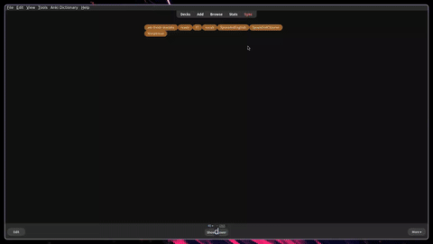
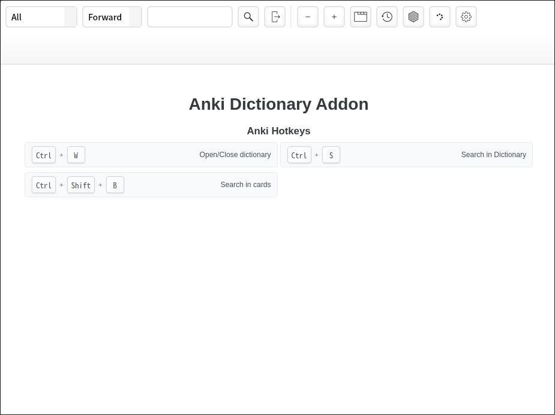
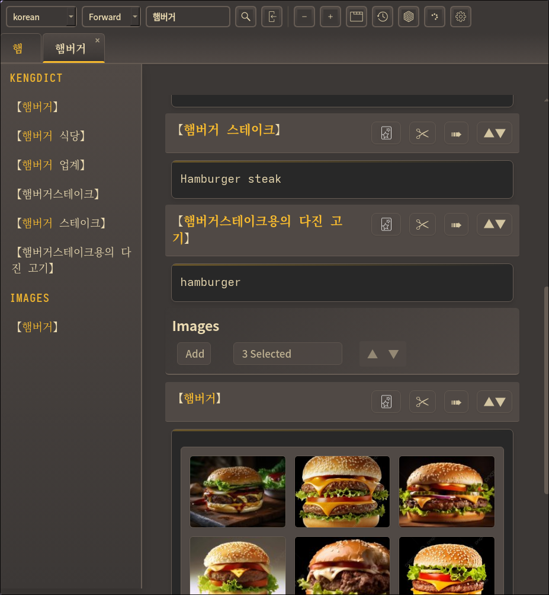
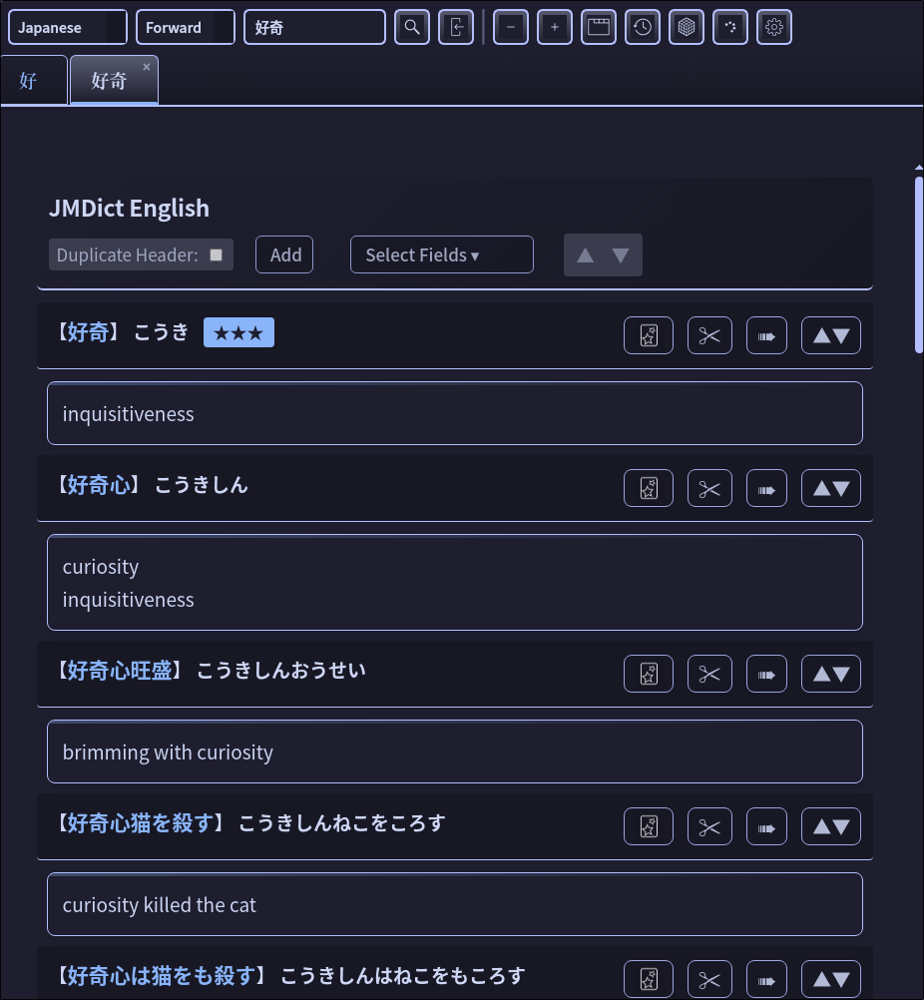
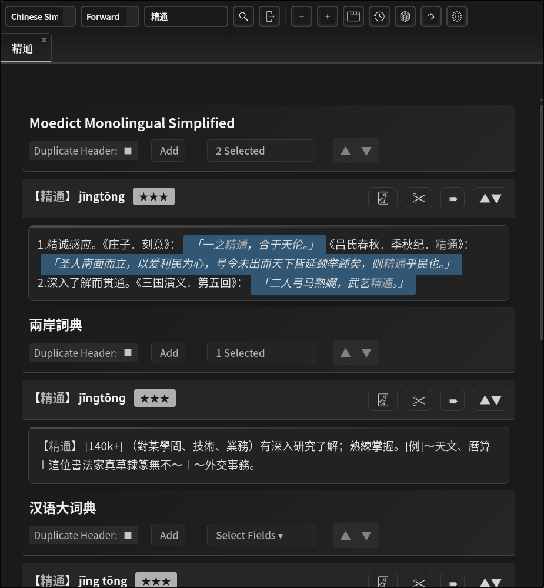

-----

\<h2 align="center"\>Anki Dictionary Addon \</h2\>
\<p align="center"\>
\<a href="[https://www.gnu.org/licenses/agpl-3.0.html](https://www.gnu.org/licenses/agpl-3.0.html)" title="License: GNU AGPLv3"\>
\
\</a\>
\</p\>

\<p align="center"\>
\
\</p\>

-----

## Core Features

The **Anki Dictionary Addon** is a high-performance lookup and card-creation tool designed for modern language learners.

  * **Fast Export to Anki:** Create rich, formatted flashcards instantly. Export definitions, example sentences, and audio directly to your decks without leaving the search interface.
  * **AI-Powered Definitions:** Integrated **LLM API support** (OpenAI, Ollama, etc.) allows you to generate context-aware definitions and simplified explanations for complex terms.
  * **Integrated Image Search:** Quickly find and attach visual aids to your cards via built-in DuckDuckGo image search, ensuring your cards are highly memorable.
  * **Multi-Dictionary Support:** Aggregate results from multiple local and online sources, including frequency data and native pronunciations.
  * **Cross-Platform Ready:** Fully tested and optimized for **macOS** and **Linux**.

-----

## Overview

This addon is the modern successor to the [Migaku Dictionary Addon](https://github.com/migaku-official/Migaku-Dictionary-Addon), rebuilt for **Anki 25.09+** compatibility.

  - **Modern Architecture:** Completely reorganized codebase following Python best practices for better stability.
  - **Enhanced UX:** Improved styling and responsive interface design.
  - **Privacy Focused:** Image searches are handled via DuckDuckGo for better privacy and reliability.
  - **Theme Support:** Includes popular palettes like Gruvbox and Catppuccin.

### Themes

\<p align="center"\>
\
\
\</p\>
\<p align="center"\>
\
\
\</p\>

-----

## Table of Contents

  - [Status & Compatibility](https://www.google.com/search?q=%23status)
  - [Installation](https://www.google.com/search?q=%23installation)
  - [Usage](https://www.google.com/search?q=%23usage)
  - [Development](https://www.google.com/search?q=%23development)
  - [Building](https://www.google.com/search?q=%23building)
  - [License and Credits](https://www.google.com/search?q=%23license-and-credits)

-----

## Status

### Compatibility

  - **Operating Systems:** Fully tested on **macOS** and **Linux**. (Windows support is functional via cross-platform library adjustments).
  - **Anki Version:** Optimized for Anki version **25.07** through **25.09.2+**.

-----

## Installation

1.  **Install Anki:** Ensure you have a supported version of Anki. [Download Anki](https://apps.ankiweb.net/)
2.  **Download the Addon:**
      - Clone or download this repository.
      - Unzip the contents to your Anki addons folder:
          - **macOS:** `~/Library/Application Support/Anki2/addons21/`
          - **Linux:** `~/.local/share/Anki2/addons21/`
          - **Windows:** `%APPDATA%\Anki2\addons21\`

-----

## Usage

For a visual guide on how to configure your dictionaries and export cards, refer to the following video:

[](https://www.youtube.com/watch?v=vrzBeiFlKjg)

-----

## Project Structure

```
src/anki_dictionary/     # Main package
├── core/                # Database and dictionary logic
├── ui/                  # PyQt6 interface components
├── integrations/        # LLM (AI) and Image search integrations
├── exporters/           # Anki card generation logic
└── web/                 # HTML/JS rendering components
```

-----

## Development

The addon follows modern Python development practices:

1.  **Setup:**

    ```bash
    git clone <repository-url>
    cd anki-dictionary-addon
    uv sync # Or: python dev.py install
    ```

2.  **Workflow:**

    ```bash
    python dev.py ci     # Run linting + tests
    python dev.py build  # Build for testing
    ```

-----

## License and Credits

The **Anki Dictionary Addon** is a successor to the [Migaku Dictionary Addon](https://github.com/migaku-official/Migaku-Dictionary-Addon).

This project is **free and open-source software**. The code is released under the **GNU AGPLv3 license**. Please see the [LICENSE](https://www.gnu.org/licenses/agpl-3.0.html) file for details.

-----

*Feel free to contribute to the project or report issues via the GitHub Issue tracker.*
